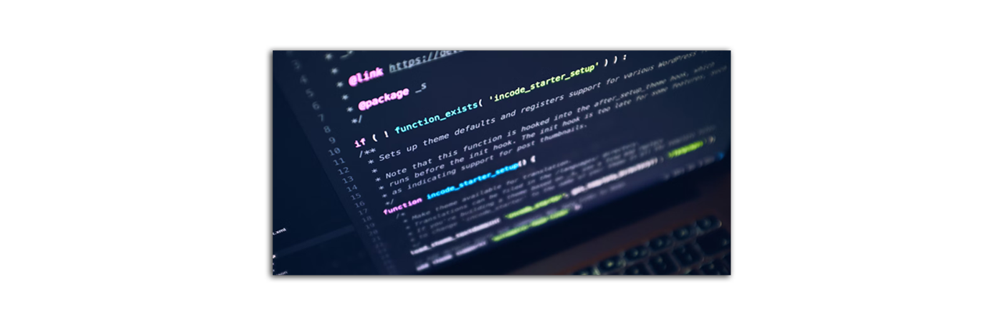
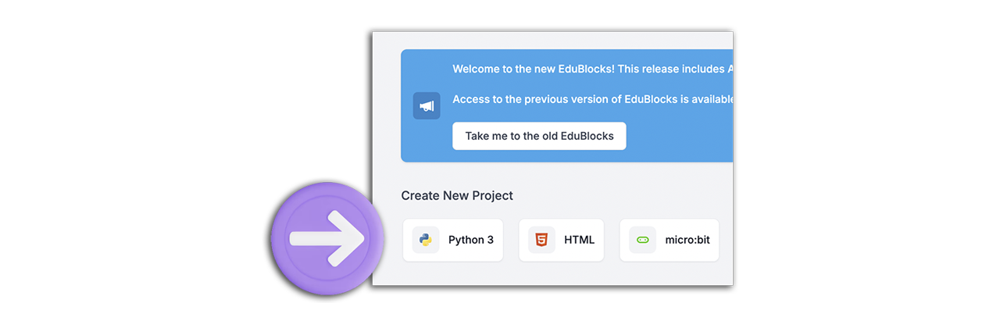
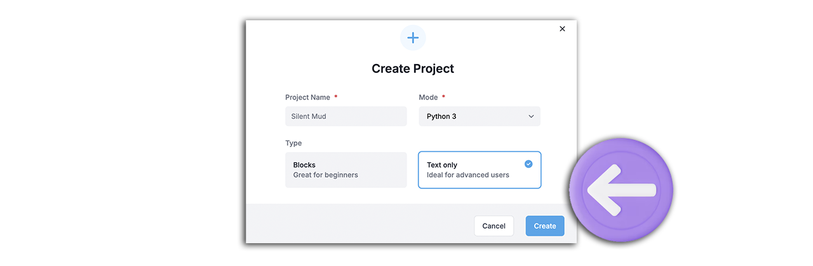
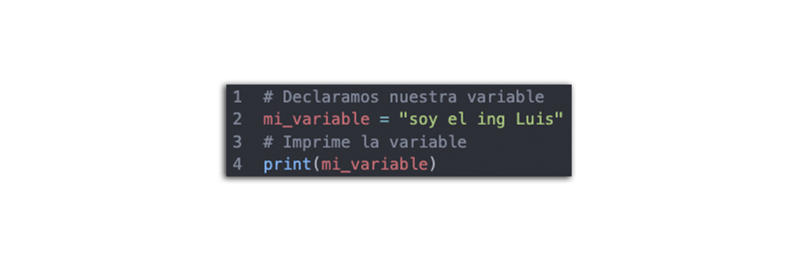
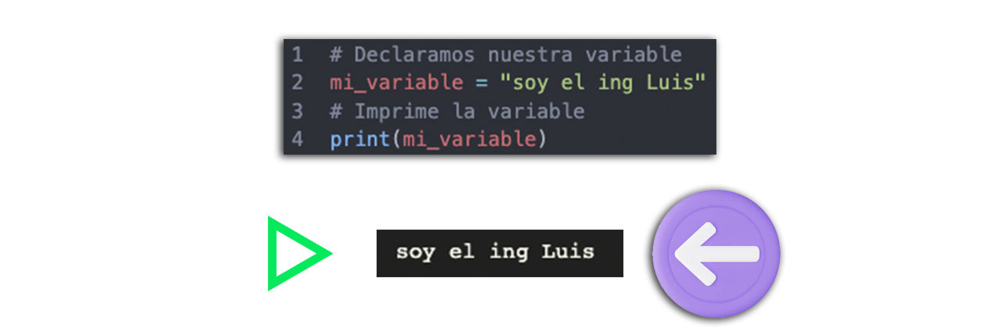
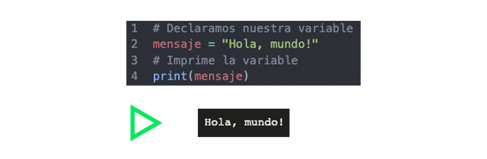
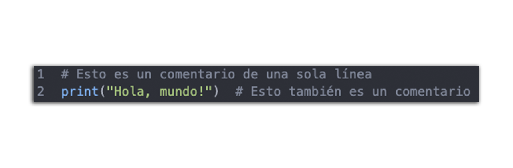
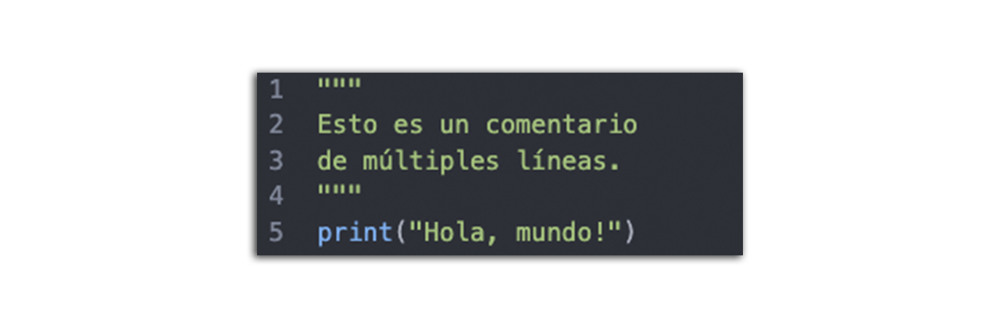
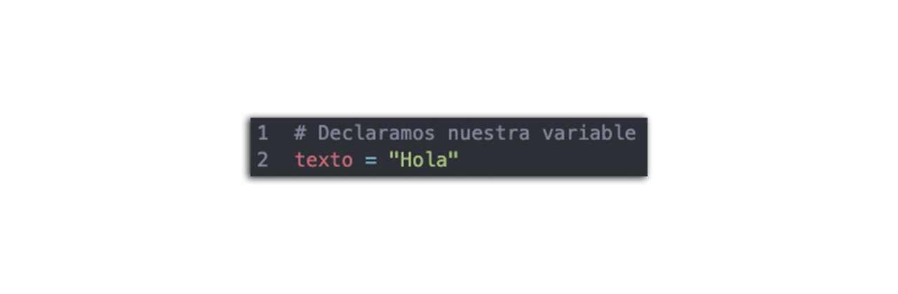

Presentación e introducción al PLC (Pensamiento Lógico Computacional)

## 👋 Presentación
- Te damos la bienvenida a esta sesión de introducción de Python como lenguaje de programación.

## 🎯 Objetivo

En esta primera sesión comezarás con la **introducción** al lenguaje de programación **Python**,conocerás los precedentes del lenguaje, conocerás que es un editor de texto y lo más importante será conocer los pilares del pensamiento lógico computacional.

## Requisitos Previos

* Tener conocimientos de informática intermedios, archivos y carpetas, además de saber usar apps (como las de hojas de cálculo, procesadores de texto o editores de fotos).

* Ser capaz de descargar, instalar y actualizar software.


## 📮 Requerimientos
A continuación se muestran los requsitos mínimos para poder realizar las prácticas de manera correcta.<br>
<ul>
    <li> Cumputadora o Smartphone </li>
    <li> Conexión a internet</li>
    <li> Creatividad </li>
    <li> Atención </li>
</ul>

## ⏳ Precendentes

* **Python** es un lenguaje de programación de alto nivel (significa que esta diseñado para ser fácil de leer y escribir ) que fue creado por **Guido van Rossum** a finales de los años 80 y principios de los 90"s. Van Rossum comenzó a trabajar en Python en diciembre de 1989 como un proyecto personal durante su tiempo en el Centro para las Matemáticas y la Computación (CWI) en los Países Bajos.

* El objetivo de Van Rossum era crear un lenguaje que fuera fácil de leer y aprender, inspirado en el lenguaje de programación ABC. La primera versión pública de Python, la 0.9.0, se lanzó en febrero de **1991**. Desde entonces, Python ha evolucionado significativamente, con la versión 1.0 lanzada en enero de 1994, la versión 2.0 en octubre de 2000, y la versión 3.0 en diciembre de 2008.

* Python es conocido por su **sintaxis**( es un conjunto de reglas y estructuras que definen cómo se deben escribir las instrucciones en un lenguaje de programación específico ) clara y legible, lo que lo convierte en una excelente opción tanto para principiantes como para desarrolladores experimentados. Hoy en día, se utiliza en una amplia variedad de aplicaciones, desde desarrollo web hasta análisis de datos e IA.



## 👩‍💻 Pilares del Pensamiento Lógico Computacional


Proceso mental a través del cual una persona se plantea un problema 
y para su posible solución utiliza una secuencia de instrucciones.
## Descomposición
* Consiste en dividir un problema complejo en partes más pequeñas y manejables. 
Podemos ver a la descomposición como la ruptura de un problema en partes más pequeñas.

## Reconocimiento de patrones
* Una vez que has descompuesto el problema en partes más pequeñas, busca estándares o características comunes. Encontrar similitudes que se comparten te ayudará a resolver el sistema de manera más eficiente.

## Abstracción
* La abstracción implica centrarse en la información importante y dejar de lado las características irrelevantes. 

## Algoritmo
* Plan o conjunto de instrucciones, para resolver un problema.
“Ejemplo, menciona los pasos para preparar cereal”

## 💻 Primer práctica Hola Mundo

* Primero vamos a abrir nuestro explorador chrome, si no cuentas con el <a href="https://www.google.com.mx/intl/es-419/chrome/?gad_source=1&gclid=Cj0KCQjwzby1BhCQARIsAJ_0t5N9F0tV5OBlWxzP785Q2fblTO_UyMzBYiJM26qwGTDhwThDHi1Y6bUaAl8yEALw_wcB">Puedes Descargarlo aquí.</a></p>

* Vas a dirigirte a <a href="https://www.google.com.mx/intl/es-419/chrome/?gad_source=1&gclid=Cj0KCQjwzby1BhCQARIsAJ_0t5N9F0tV5OBlWxzP785Q2fblTO_UyMzBYiJM26qwGTDhwThDHi1Y6bUaAl8yEALw_wcB">Edublocks</a> que será nuestro editor online para hacer nuestras primeras prácticas, recuerda que este editor puede presentar fallos o bugs si se abre en un explorador diferente a chrome.</p> 


* Tienes que dar click en el siguiente botón para comenzar a codificar


* Vas a seleccionar la opción de Only Text y create
 

* Verás un editor de texto como el siguiente, tendrás que escribir lo siguiente: print("Hola mundo")
 

# Conceptos Básicos

A continuación haremos un repaso por los conceptos que usaremos a lo largo del curso y en todos los ejercicios que harás de ahora en adelante.

## Variables

Las variables en Python son fundamentales para almacenar y manipular datos vamos a ver un ejemplo.

```Python
a = 10
b = 9
suma = a + b
print(suma)

```

 

## "Correr el código"

* Ejecutar un código se refiere al proceso de llevar a cabo las instrucciones escritas en un programa informático.

* Cuando ejecutas un código, el sistema operativo carga el programa en la memoria y sigue las instrucciones que has escrito. Esto puede incluir cálculos, manipulación de datos, interacción con el usuario, y más.

* En Python, ejecutar un código es bastante sencillo. Puedes hacerlo directamente desde la terminal o usando un entorno de desarrollo integrado (IDE) como PyCharm o Visual Studio Code3 o en un editor en linea como Edublocks.

* Generalmente tenemos que presionar un boton de play para "Correr nuestro programa" com lo vemos a continuación:

 


## Print - Imprimir en pantalla

La función print() en Python se utiliza para mostrar información en la pantalla. Aquí tienes algunos aspectos clave sobre su uso.

 

```Python 
print("Hola Mundo")
```

## Comentarios

En Python, los comentarios son útiles para explicar el código y hacerlo más legible. Aquí tienes las dos formas principales de agregar comentarios.

* Comentarios de una sola línea: Utiliza el símbolo de numeral (#) al inicio de la línea. Este tipo de comentarios son útiles para recordar en un futuro lo que hiciste en tus códigos o simplemente tener un código mas legible.

 

```Python
#Ejemplo de Comentario
```
* Comentarios de múltiples líneas: Utiliza tres comillas dobles (""") al inicio y al final del bloque de texto. Esta opción es bastante útil si deseas hacer un comentario extenso de tu código.

 


## Texto simple en Python

Para trabajar con texto simple en Python, puedes usar cadenas de texto (strings). Si soló quieres mostrar un mensaje puedes escribirlo dentro de las comillas dobles como se muestra a continuación "Hola"
 

```Python
print("Esto es texto")
```

# Buenas prácticas

Las buenas prácticas en programación son un conjunto de técnicas, principios y metodologías que los desarrolladores siguen para escribir código más legible, mantenible y eficiente. Aquí te dejo algunas de las más importantes.

- [Tips y buenas prácticas en Python ](buenas-practicas/Readme.md)


## 📝 Organización de la clase
- [Ejemplos](/Sesion-01/ejercicios/ejercicios-basicos.py)
- [Práctica](practica/README.md)
- [Sesión 02](/Sesion-02/Readme.md)

## 👨‍🏫  Sesiones